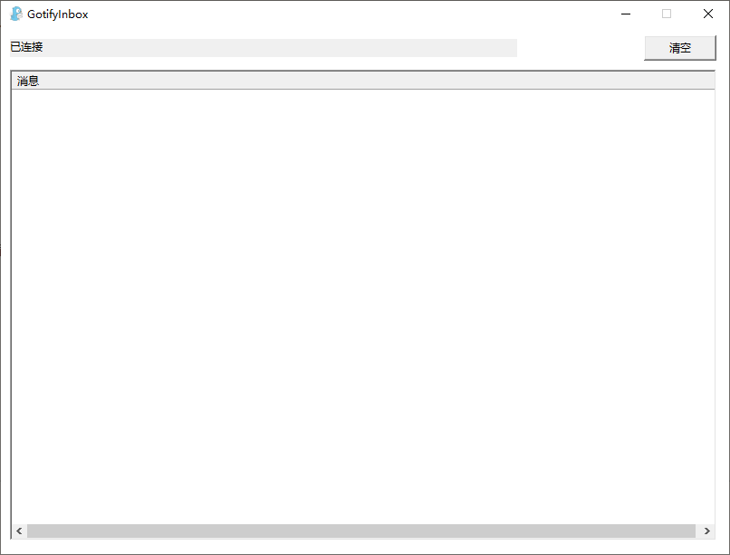
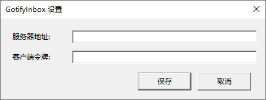

# GotifyInbox(Win32 C++ 版)

单文件、零第三方依赖的 Gotify 桌面客户端,替代原 .NET 版(29MB)。

## 截图

主界面:



设置界面:



## 功能

- 实时接收 gotify 消息(wss,Schannel TLS 证书自动验证)
- 启动自动连接:配置完整时最小化到托盘并自动连接;未配置时提示引导配置
- 托盘交互:左键 → 显示主界面;右键 → 消息 / 设置 / 退出
- 新消息到达且主界面隐藏时,托盘图标闪烁提醒(6 秒)
- 消息列表右键 → 复制消息(标题 + 正文 + 时间)
- 历史消息持久化(`message.json`,exe 同目录,与旧版格式兼容)
- 断线自动重连(固定启用):指数退避 2s → 4s → 8s → 16s → 32s → 60s
- 主界面:状态文本 + 清空 + 消息列表(显示 `[应用名] 标题 - 内容`)
- 关闭窗口隐藏到托盘;退出仅通过托盘右键菜单

## 使用

1. 双击 `GotifyInbox.exe` 运行(无需安装)
2. 首次运行(未配置)会弹出设置窗口:
   - **服务器地址**:如 `https://example.com`(必须以 `http://` 或 `https://` 开头)
   - **客户端令牌**:gotify Web 界面 → 客户端 → 创建客户端 获得
   (断线自动重连为固定启用,无需配置)
3. 保存后自动连接,最小化到托盘
4. 后续修改设置:托盘右键 → 设置
5. 令牌无效、服务器地址错误、证书校验失败等**永久性错误**会停止自动重连(状态栏显示错误),
   修改设置保存后自动恢复连接;瞬时网络故障(超时/断线)会自动指数退避重连

## 数据位置

配置与历史默认保存在 **exe 所在目录**(随程序走,移动/复制程序目录即带走数据);
若 exe 目录不可写(如安装到 Program Files),自动回退到 `%APPDATA%\GotifyInbox`(状态栏会有提示):

| 文件 | 说明 |
|---|---|
| `config.json` | 配置(服务器地址/客户端令牌) |
| `message.json` | 历史消息 |

## 运行环境

- Windows 10 / 11 x64
- 无需 .NET 运行时,零第三方依赖(仅系统库)

## 构建

需要 Visual Studio 2022(MSVC + Windows SDK)。在项目根目录运行:

```
build.bat
```

产物:`build\GotifyInbox.exe`
